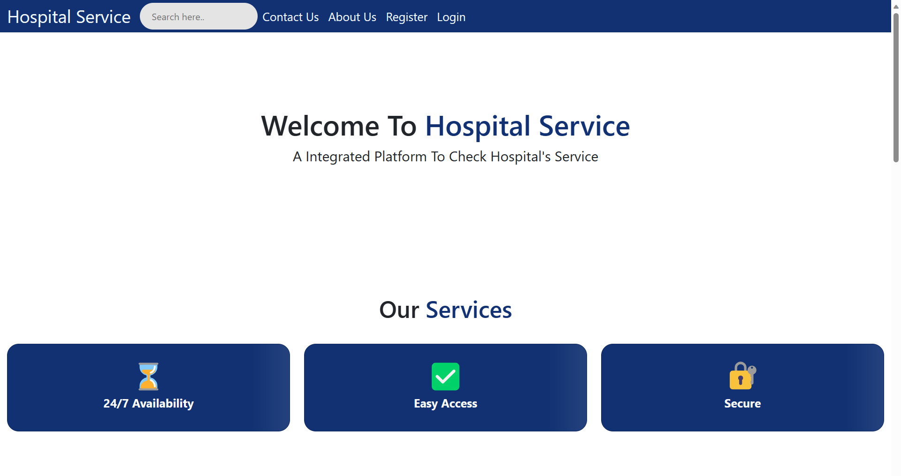
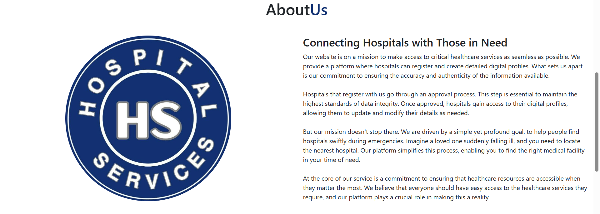
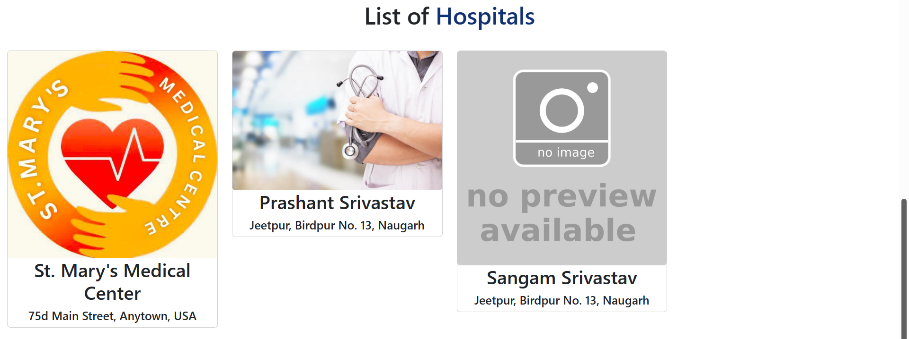
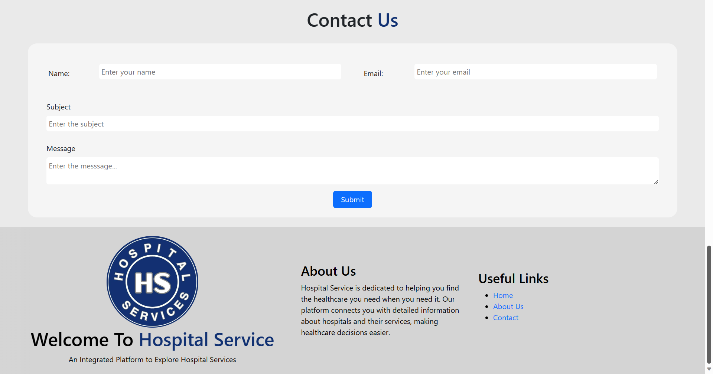
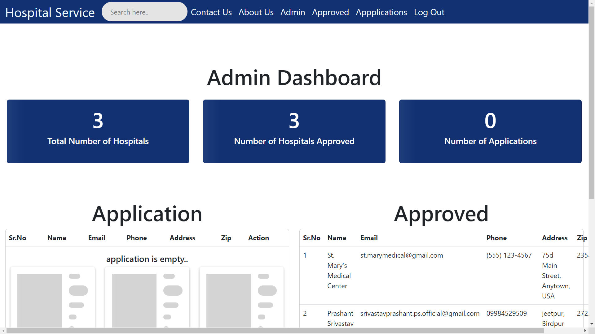
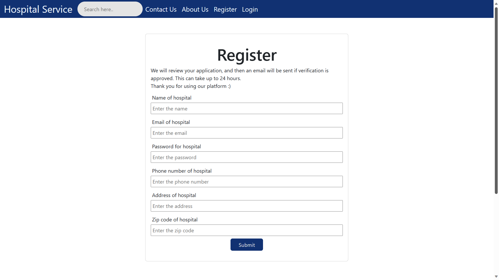
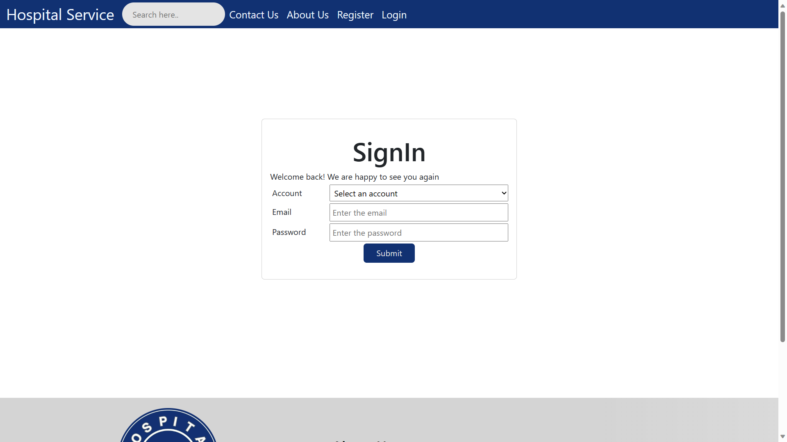
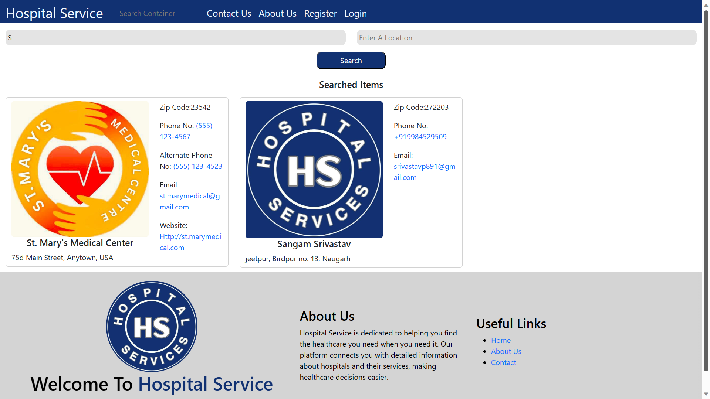

# Hospital Service - Your Trusted Healthcare Companion

## About Us

Welcome to Hospital Service, your go-to platform for seamless access to critical healthcare services. Our mission is to make it easier for hospitals to register and create detailed digital profiles while ensuring the accuracy and authenticity of the information they provide.

### What Sets Us Apart

At Hospital Service, we understand the importance of accurate and up-to-date healthcare information. Here's what sets us apart:

- **Data Integrity:** Hospitals registering with us go through a meticulous approval process to maintain the highest standards of data accuracy.

- **Hospital Empowerment:** Approved hospitals gain access to their digital profiles, allowing them to update and modify their details as needed.

- **Emergency Assistance:** Our platform is designed to help people find hospitals swiftly during emergencies, ensuring they can access the right medical facility when it matters the most.

## Our Mission

Our mission is simple yet profound: to help people find hospitals quickly during times of need. Whether it's a sudden illness or a medical emergency, our platform simplifies the process of locating the nearest and most suitable healthcare facility.

## Accessible Healthcare for All

At Hospital Service, we believe that everyone should have easy access to the healthcare services they require. Our platform plays a crucial role in making this a reality by connecting individuals with trusted hospitals and healthcare providers.
## ScreenShots
- home

- Admin dashboard

- register

- Signin

- Search

